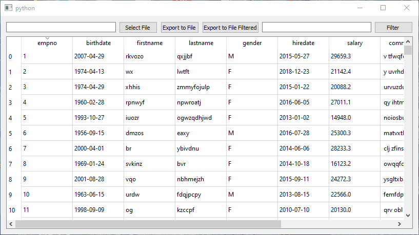

# MySQL-db-viewer
One of test tasks for DS position, PyQT + Pandas



Based on Pandas PyQT module, filter functions provided by pandas.query()
Use & as AND, | as OR, == as EQUAL, non-numeric variabels (not table columns) should be incased in "". 

## Structure

**db_setup.py** contains functions for connecting for db and creating necessary tabels (if non existant).  
**interface.py** contains functions necessary for filtering.  
**widget.py** contains Qt abstract table class and methods to render it.  
**rand.py** contains functions for generating random data to fill up the tabels.   
**sql.txt** contains SQL query for grabbin data from db.  
**config.json** contains db login and password.

## Example 

As pandas query syntax was used, query for selecting female employees with their number above 100 you should use
```
  epmno > 100 & gender == "F"
```
you can see that **F** is non-numeric, it should be encased in quotation.
